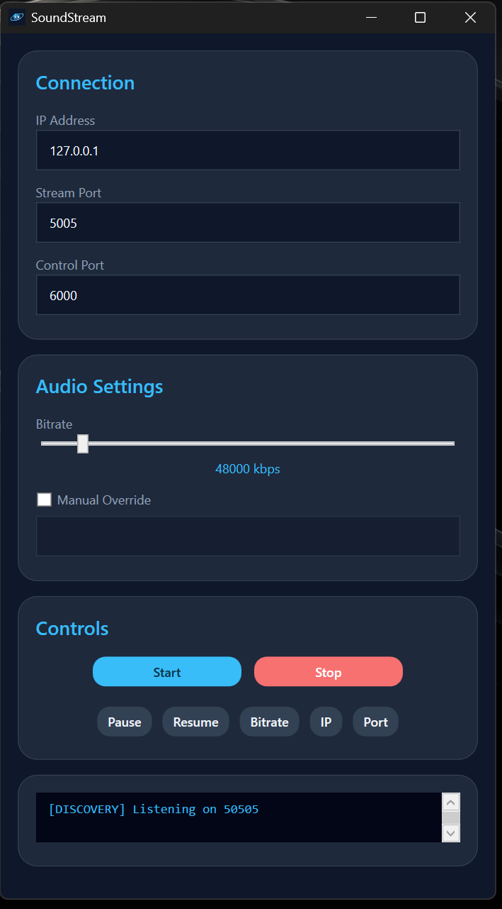
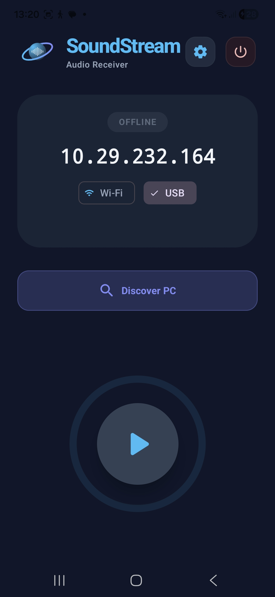
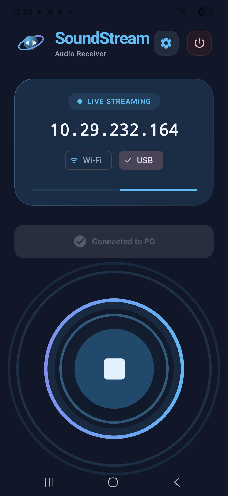

# SoundStream

Real-time low latency audio streaming from PC to Android over LAN  using C++, C# WPF, and Android Kotlin with Opus compression and custom UDP networking.

---

# Features

- Real-time desktop audio streaming
- Low latency UDP transport
- Opus audio compression
- Packet sequencing + jitter buffering
- Automatic LAN discovery + handshake
- HMAC-secured handshake packets
- Modern WPF desktop controller
- Android foreground audio receiver service
- System tray integration
- Dynamic bitrate control
- Packet reordering + resync logic
- Manual or automatic IP connection

Works over:
- WiFi
- USB tethering
- Ethernet

---

# Architecture

## PC Side

### C++ Relay Server
Handles:
- desktop audio capture
- Opus encoding
- UDP packet streaming
- control command handling

### C# WPF Controller
Handles:
- launching relay server
- bitrate controls
- discovery listener
- handshake management
- system tray support
- UI/logging

---

## Android Side

### Kotlin Foreground Service
Handles:
- UDP packet receiving
- jitter buffering
- packet reordering
- Opus decoding
- AudioTrack playback
- connection monitoring


# Networking

## Discovery Protocol

Automatic LAN discovery using UDP broadcast.

Phone sends:

```text
SOUNDSTREAM_DISCOVER
```

PC responds:

```text
SOUNDSTREAM_HERE <ip>
```

Then Android sends authenticated handshake:

```text
HELLO|<ip>|<port>|<hmac>
```

---

# Security

Current security model:
- LAN-only usage
- HMAC-authenticated handshake
- Replay-resistant session flow
- No internet exposure intended

This project is designed for trusted local networks.

---

# Audio Pipeline

```text
Desktop Audio
    ↓
Opus Encoder
    ↓
UDP Packetizer
    ↓
WiFi / LAN
    ↓
Android Jitter Buffer
    ↓
Opus Decoder
    ↓
AudioTrack Playback
```

---

# WiFi Notes

USB tethering provides the best stability.

WiFi performance depends heavily on:
- router quality
- interference
- signal strength
- 2.4GHz vs 5GHz

The Android client includes:
- packet reordering
- jitter buffering
- stall recovery
- decoder resync logic

to improve playback stability on unstable networks.

---
# Screenshots


## Desktop Application


    


# Author

Omer Bilget
